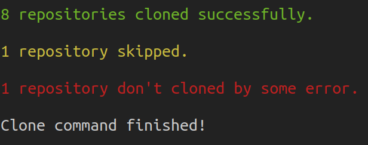
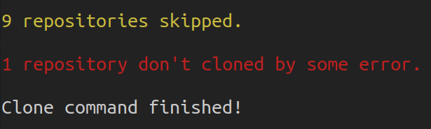
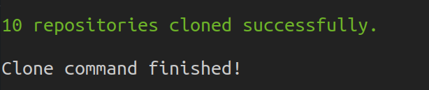
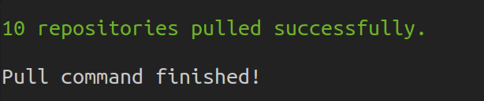

# AutoGit

## Install

```shell
$ python -m venv venv
$ source venv/bin/activate
(venv) $ pip install -r requirements.txt
(venv) $ python -m autogit --version
```

## Yaml file

The script needs only one required argument, the yaml file with the repositories to clone or update.

The file must to follow the next structure:

```yaml
l10n-es:
    origin: https://github.com/OCA/l10n-es
    branch: 16.0
    depth: 1

stock-logistics-workflow:
    origin: https://github.com/OCA/stock-logistics-workflow
    branch: 16.0
    depth: 1

# etc
```

## How to use it?

### Clone

Clone each repository set at the yaml file in the directory specified:

```shell
(venv) $ python -m autogit clone /location/of/my/repos.yaml -d /home/me/my-repos/
```

Directory content before to run the script:

```shell
my-repos
├─── .
└─── ..
```

Directory content after to run the script:

```shell
my-repos
├─── .
├─── ..
├─── l10n-es/
└─── stock-logistics-workflow/
```

The script check if the repo already exists in the directory before to clone it.

### Pull

Pull each repository set at the yaml file in the directory specified:

```shell
(venv) $ python -m autogit pull /location/of/my/repos.yaml -d /home/me/my-repos/
```

If the repository does not exist inside the directory specified, it will be skipped.

## Script execution output

The script show the regular git action output for each repository, and cath any exception or trouble to print a resume in the terminal stdout.

Examples:

Suppose we rely on a yaml file with ten repositories.

- Clone command. 8 ok, 1 skipped (already exists), 1 error.

    

- Clone command. 9 skipped (already exists), 1 error.

    

- Clone command. 10 ok.

    

- Pull command. 10 ok.

    
